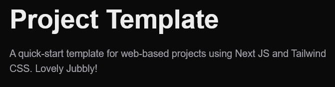
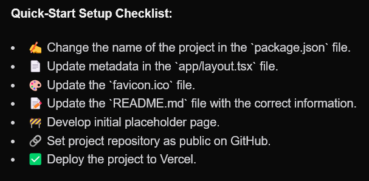

# Project Title

Project Description : A brief description of what this project does and who it's for.


    
## Installation

All installation can be done with `npm`/`pnpm`/`yarn`

```bash
    pnpm install
```

## Tech Stack

| **LIBRARY**    | **DOCS**                                                               |
|----------------|------------------------------------------------------------------------|
| `React`        | [link](https://www.rdocumentation.org/packages/shiny/versions/1.8.1.1) |
| `Next JS`      | [link](https://rstudio.github.io/shinydashboard/index.html)            |
| `Tailwind CSS` | [link](https://www.rdocumentation.org/packages/dplyr/versions/1.0.10)  |

## Screenshots


## Authorship & Feedback
This project was created and developed by [@sam-mata](https://github.com/sam-mata).

If you have any feedback, please reach out at through [email](mailto:sammatanz@gmail.com), [LinkedIn](https://www.linkedin.com/in/sam-mata/), or [my website](https://sammatanz.com).
